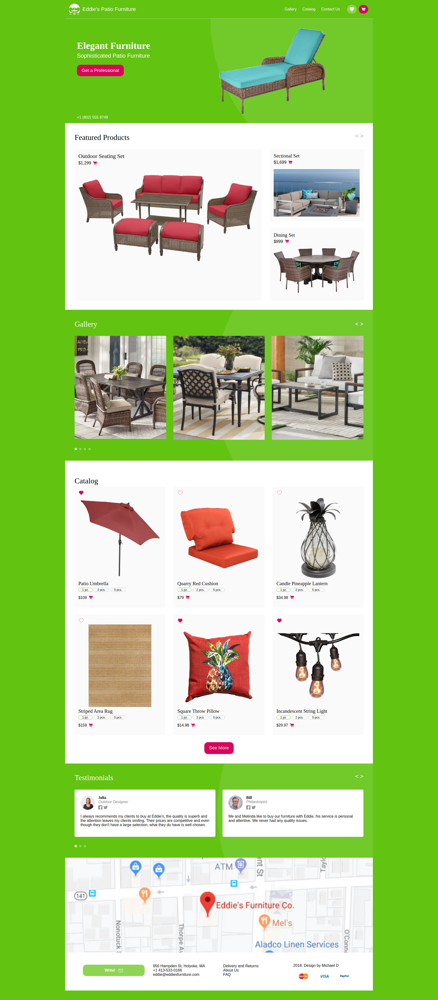

# E-Shop Frontend
> An e-commerce website based on the design of [Michael D](https://dribbble.com/altezzik).
> The original design for this project can be found at [behance.net](https://www.behance.net/gallery/69329213/Flower-e-shop).

Currently this project contains a landing page with different sections and ways of showing products, a catalog page and a product page. In the future it would be nice to add a contact page.

## Built With

- HTML5 and CSS3

**This page was built for it's design so it's not interactive.**

## Live Demo (Development Branch)

[Live Demo Link](http://raw.githack.com/bx44/eshop-frontend/main-dev/index.html)

## Screenshot

A screenshot of the mobile version can be found in the 'img' folder as screenshot2.png.

## Author

👤 **Barak Ben-Hamu**

- Github: [@bx44](https://github.com/bx44)

## Credits

Icons made by Yi Chen, Vectplus and Nanda Ririz from [the Noun Project](https://thenounproject.com/) and Kiranshastry, Roundicons, Pixel Buddha, Pixel perfect and Freepik from [flaticon.com](https://www.flaticon.com/).

## 🤝 Contributing

Contributions, issues and feature requests are welcome!

Feel free to check the [issues page](https://github.com/bx44/eshop-frontend/issues).
